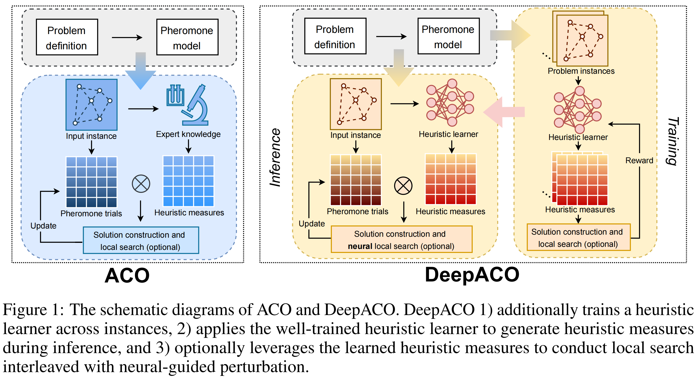

# [NeurIPS 2023] DeepACO: Neural-enhanced Ant Systems for Combinatorial Optimization

🥳 **Welcome!** This codebase accompanies the paper [*DeepACO: Neural-enhanced Ant Systems for Combinatorial Optimization*](https://arxiv.org/abs/2309.14032). 

## 🚀 Introduction
DeepACO is a generic framework that leverages deep reinforcement learning to automate heuristic designs. It serves to strengthen the heuristic measures of existing ACO algorithms and dispense with laborious manual design in future ACO applications.




## 🔑 Usage

### Dependencies

- Python 3.8
- CUDA 11.0 (Using a CPU works just as well 🥺)
- PyTorch 1.7.0
- [PyTorch Scatter](https://github.com/rusty1s/pytorch_scatter) 2.0.7
- [PyTorch Sparse](https://github.com/rusty1s/pytorch_sparse) 0.6.9
- [PyTorch Geometric](https://github.com/pyg-team/pytorch_geometric) 2.0.4
- d2l
- [networkx](https://networkx.org/) 2.8.4
- [numpy](https://numpy.org/) 1.23.3
- [numba](https://numba.pydata.org/) 0.56.4

### Available Problems

- **Traveling Salesman Problem (TSP).** Please refer to [`tsp/`](/tsp) for vanilla DeepACO and [`tsp_nls/`](/tsp_nls) for DeepACO with NLS on TSP.
- **Capacitated Vehicle Routing Problem (CVRP).** Please refer to [`cvrp/`](/cvrp) for vanilla DeepACO and [`cvrp_nls/`](/cvrp_nls) for DeepACO with NLS on CVRP.
- **Orienteering Problem (OP).** Please refer to [`op/`](/op).
- **Prize Collecting Travelling Salesman Problem (PCTSP).** Please refer to [`pctsp/`](/pctsp).
- **Sequential Ordering Problem (SOP).** Please refer to [`sop/`](/sop).
- **Single Machine Total Weighted Tardiness Problem (SMTWTP).** Please refer to [`smtwtp/`](/smtwtp).
- **Resource-Constrained Project Scheduling Problem (RCPSP).** Please refer to [`rcpsp/`](/rcpsp).
- **Multiple Knapsack Problem (MKP).** Please refer to [`mkp/`](/mkp) for the implementation of pheromone model $PH_{suc}$ and [`mkp_transformer/`](/mkp_transformer) for that of $PH_{items}$.
- **Bin Packing Problem (BPP).** Please refer to [`bpp/`](/bpp).


## 🎥 Resources
- An elegant DeepACO implementation can be found in [RL4CO](https://github.com/ai4co/rl4co) library.
- You may be interested in [ReEvo: Large Language Models as Hyper-Heuristics with Reflective Evolution](https://github.com/ai4co/LLM-as-HH). ReEvo leverages large language models to automate heuristic designs under a reflective evolution framework. It outperforms DeepACO in terms of the scalability and generality of the heuristics.
- You may be interested in [Ant Colony Sampling with GFlowNets for Combinatorial Optimization](https://github.com/ai4co/gfacs) by Minsu Kim, Sanghyeok Choi, Jiwoo Son, Hyeonah Kim, Jinkyoo Park, and Yoshua Bengio, which suggests that DeepACO can be improved by training with GFlowNets.
- [Video and slides](https://neurips.cc/virtual/2023/poster/71083)
- [Video-Chinese](https://www.bilibili.com/video/BV1Pv42117mQ)
- [Blog-Chinese](https://zhuanlan.zhihu.com/p/659645922)

## 🤩 Citation
If you encounter any difficulty using our code, please do not hesitate to submit an issue or directly contact us!

If you do find our code helpful (or if you would be so kind as to offer us some encouragement), please consider kindly giving a star, and citing our paper.

```bibtex
@inproceedings{ye2023deepaco,
  title={DeepACO: Neural-enhanced Ant Systems for Combinatorial Optimization},
  author={Ye, Haoran and Wang, Jiarui and Cao, Zhiguang and Liang, Helan and Li, Yong},
  booktitle={Advances in Neural Information Processing Systems},
  year={2023}
}
```
